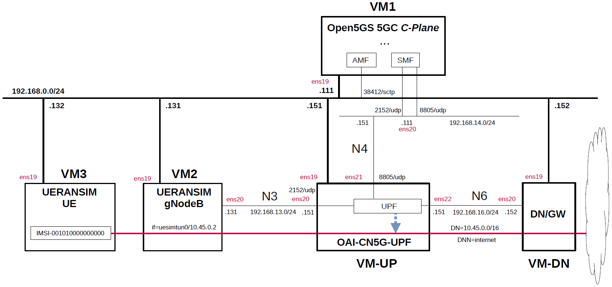

# Open5GS 5GC & UERANSIM UE / RAN Sample Configuration - OAI-CN5G-UPF(eBPF/XDP UPF)
This describes a simple configuration for working Open5GS 5GC and OAI-CN5G-UPF(eBPF/XDP UPF).
In particular, see [here](https://github.com/s5uishida/install_oai_upf) for OAI-CN5G-UPF.

---

### [Sample Configurations and Miscellaneous for Mobile Network](https://github.com/s5uishida/sample_config_misc_for_mobile_network)

---

<a id="toc"></a>

## Table of Contents

- [Overview of Open5GS 5GC Simulation Mobile Network](#overview)
- [Changes in configuration files of Open5GS 5GC, OAI-CN5G-UPF and UERANSIM UE / RAN](#changes)
  - [Changes in configuration files of Open5GS 5GC C-Plane](#changes_cp)
  - [Changes in configuration files of OAI-CN5G-UPF](#changes_up)
  - [Changes in configuration files of UERANSIM UE / RAN](#changes_ueransim)
    - [Changes in configuration files of RAN](#changes_ran)
    - [Changes in configuration files of UE (IMSI-001010000000000)](#changes_ue)
- [Network settings of Open5GS 5GC, OAI-CN5G-UPF and UERANSIM UE / RAN](#network_settings)
  - [Network settings of Data Network Gateway](#network_settings_up)
- [Build Open5GS, OAI-CN5G-UPF and UERANSIM](#build)
- [Run Open5GS 5GC, OAI-CN5G-UPF and UERANSIM UE / RAN](#run)
  - [Run OAI-CN5G-UPF](#run_up)
  - [Run Open5GS 5GC C-Plane](#run_cp)
  - [Run UERANSIM](#run_ueran)
    - [Start gNB](#start_gnb)
    - [Start UE](#start_ue)
- [Ping google.com](#ping)
  - [Case for going through DN 10.45.0.0/16](#ping_1)
- [Changelog (summary)](#changelog)

---

<a id="overview"></a>

## Overview of Open5GS 5GC Simulation Mobile Network

This describes a simple configuration of C-Plane, eBPF/XDP UPF and Data Network Gateway for Open5GS 5GC.
**Note that this configuration is implemented with Proxmox VE VMs.**

The following minimum configuration was set as a condition.
- One UPF and Data Network Gateway
- One UE and one DNN

The built simulation environment is as follows.

</img>

The 5GC / eBPF/XDP UPF / UE / RAN used are as follows.
- 5GC - Open5GS v2.7.6 (2026.01.17) - https://github.com/open5gs/open5gs
- eBPF/XDP UPF - OAI-CN5G-UPF v2.2.0 (2025.12.13) - https://gitlab.eurecom.fr/oai/cn5g/oai-cn5g-upf
- UE / RAN - UERANSIM v3.2.7 (2025.10.25) - https://github.com/aligungr/UERANSIM

Each VMs are as follows.  
| VM | SW & Role | IP address | OS | CPU<br>(Min) | Mem<br>(Min) | HDD<br>(Min) |
| --- | --- | --- | --- | --- | --- | --- |
| VM1 | Open5GS 5GC C-Plane | 192.168.0.111/24 | Ubuntu 24.04 | 1 | 2GB | 20GB |
| VM-UP | OAI-CN5G-UPF U-Plane | 192.168.0.151/24 | Ubuntu 22.04 | 1 | 6GB | 20GB |
| VM-DN | Data Network Gateway  | 192.168.0.152/24 | Ubuntu 24.04 | 1 | 1GB | 10GB |
| VM2 | UERANSIM RAN (gNodeB) | 192.168.0.131/24 | Ubuntu 24.04 | 1 | 1GB | 10GB |
| VM3 | UERANSIM UE | 192.168.0.132/24 | Ubuntu 24.04 | 1 | 1GB | 10GB |

The network interfaces of each VM are as follows.
| VM | Device | Model | Linux Bridge | IP address | Interface | XDP |
| --- | --- | --- | --- | --- | --- | --- |
| VM1 | ens18 | VirtIO | vmbr1 | 10.0.0.111/24 | (NAPT NW) | -- |
| | ens19 | VirtIO | mgbr0 | 192.168.0.111/24 | (Mgmt NW) | -- |
| | ens20 | VirtIO | vmbr4 | 192.168.14.111/24 | N4 | -- |
| VM-UP | ~~ens18~~ | ~~VirtIO~~ | ~~vmbr1~~ | ~~10.0.0.151/24~~ | ~~(NAPT NW)~~ ***down*** | -- |
| | ens19 | VirtIO | mgbr0 | 192.168.0.151/24 | (Mgmt NW) | -- |
| | ens20 | VirtIO | vmbr3 | 192.168.13.151/24 | N3 | x |
| | ens21 | VirtIO | vmbr4 | 192.168.14.151/24 | N4 | -- |
| | ens22 | VirtIO | vmbr6 | 192.168.16.151/24 | N6 | x |
| VM-DN | ens18 | VirtIO | vmbr1 | 10.0.0.152/24 | (NAPT NW) | -- |
| | ens19 | VirtIO | mgbr0 | 192.168.0.152/24 | (Mgmt NW) | -- |
| | ens20 | VirtIO | vmbr6 | 192.168.16.152/24 | N6 | -- |
| VM2 | ens18 | VirtIO | vmbr1 | 10.0.0.131/24 | (NAPT NW) | -- |
| | ens19 | VirtIO | mgbr0 | 192.168.0.131/24 | (Mgmt NW) | -- |
| | ens20 | VirtIO | vmbr3 | 192.168.13.131/24 | N3 | -- |
| VM3 | ens18 | VirtIO | vmbr1 | 10.0.0.132/24 | (NAPT NW) | -- |
| | ens19 | VirtIO | mgbr0 | 192.168.0.132/24 | (Mgmt NW) | -- |

Linux Bridges of Proxmox VE are as follows.
| Linux Bridge | Network CIDR | Interface |
| --- | --- | --- |
| vmbr1 | 10.0.0.0/24 | NAPT NW |
| mgbr0 | 192.168.0.0/24 | Mgmt NW |
| vmbr3 | 192.168.13.0/24 | N3 |
| vmbr4 | 192.168.14.0/24 | N4 |
| vmbr6 | 192.168.16.0/24 | N6 |

Subscriber Information (other information is the same) is as follows.  
**Note. Please select OP or OPc according to the setting of UERANSIM UE configuration file.**
| UE | IMSI | DNN | OP/OPc |
| --- | --- | --- | --- |
| UE | 001010000000000 | internet | OPc |

I registered these information with the Open5GS WebUI.
In addition, [3GPP TS 35.208](https://www.3gpp.org/DynaReport/35208.htm) "4.3 Test Sets" is published by 3GPP as test data for the 3GPP authentication and key generation functions (MILENAGE).

The DN is as follows.
| DN | DNN | TUNnel interface of UE |
| --- | --- | --- |
| 10.45.0.0/16 | internet | uesimtun0 |

<a id="changes"></a>

## Changes in configuration files of Open5GS 5GC, OAI-CN5G-UPF and UERANSIM UE / RAN

Please refer to the following for building Open5GS, OAI-CN5G-UPF and UERANSIM respectively.
- Open5GS v2.7.6 (2026.01.17) - https://open5gs.org/open5gs/docs/guide/02-building-open5gs-from-sources/
- OAI-CN5G-UPF v2.2.0 (2025.12.13) - https://github.com/s5uishida/install_oai_upf
- UERANSIM v3.2.7 (2025.10.25) - https://github.com/aligungr/UERANSIM/wiki/Installation

<a id="changes_cp"></a>

### Changes in configuration files of Open5GS 5GC C-Plane

The following parameters can be used in the logic that selects UPF as the connection destination by PFCP.

- DNN
- TAC (Tracking Area Code)
- nr_CellID

For the sake of simplicity, I used only DNN this time.

- `open5gs/install/etc/open5gs/amf.yaml`
```diff
--- amf.yaml.orig       2025-04-27 11:38:05.000000000 +0900
+++ amf.yaml    2025-05-04 08:12:34.196824268 +0900
@@ -20,27 +20,27 @@
         - uri: http://127.0.0.200:7777
   ngap:
     server:
-      - address: 127.0.0.5
+      - address: 192.168.0.111
   metrics:
     server:
       - address: 127.0.0.5
         port: 9090
   guami:
     - plmn_id:
-        mcc: 999
-        mnc: 70
+        mcc: 001
+        mnc: 01
       amf_id:
         region: 2
         set: 1
   tai:
     - plmn_id:
-        mcc: 999
-        mnc: 70
+        mcc: 001
+        mnc: 01
       tac: 1
   plmn_support:
     - plmn_id:
-        mcc: 999
-        mnc: 70
+        mcc: 001
+        mnc: 01
       s_nssai:
         - sst: 1
   security:
```
- `open5gs/install/etc/open5gs/nrf.yaml`
```diff
--- nrf.yaml.orig       2025-04-27 11:38:05.000000000 +0900
+++ nrf.yaml    2025-05-04 08:13:05.973154453 +0900
@@ -11,8 +11,8 @@
 nrf:
   serving:  # 5G roaming requires PLMN in NRF
     - plmn_id:
-        mcc: 999
-        mnc: 70
+        mcc: 001
+        mnc: 01
   sbi:
     server:
       - address: 127.0.0.10
```
- `open5gs/install/etc/open5gs/smf.yaml`
```diff
--- smf.yaml.orig       2025-01-15 04:12:06.000000000 +0900
+++ smf.yaml    2025-01-15 04:26:52.000000000 +0900
@@ -7,6 +7,8 @@
   max:
     ue: 1024  # The number of UE can be increased depending on memory size.
 #    peer: 64
+  parameter:
+    use_upg_vpp: true
 
 smf:
   sbi:
@@ -20,16 +22,14 @@
         - uri: http://127.0.0.200:7777
   pfcp:
     server:
-      - address: 127.0.0.4
+      - address: 192.168.14.111
     client:
       upf:
-        - address: 127.0.0.7
-  gtpc:
-    server:
-      - address: 127.0.0.4
+        - address: 192.168.14.151
+          dnn: internet
   gtpu:
     server:
-      - address: 127.0.0.4
+      - address: 192.168.14.111
   metrics:
     server:
       - address: 127.0.0.4
@@ -37,20 +37,17 @@
   session:
     - subnet: 10.45.0.0/16
       gateway: 10.45.0.1
-    - subnet: 2001:db8:cafe::/48
-      gateway: 2001:db8:cafe::1
+      dnn: internet
   dns:
     - 8.8.8.8
     - 8.8.4.4
-    - 2001:4860:4860::8888
-    - 2001:4860:4860::8844
   mtu: 1400
 #  p-cscf:
 #    - 127.0.0.1
 #    - ::1
 #  ctf:
 #    enabled: auto   # auto(default)|yes|no
-  freeDiameter: /root/open5gs/install/etc/freeDiameter/smf.conf
+#  freeDiameter: /root/open5gs/install/etc/freeDiameter/smf.conf
 
 ################################################################################
 # SMF Info
```

<a id="changes_up"></a>

### Changes in configuration files of OAI-CN5G-UPF

See [here](https://github.com/s5uishida/install_oai_upf#conf) for the original file.

- `openair-upf/config.yaml`  
There is no change.

<a id="changes_ueransim"></a>

### Changes in configuration files of UERANSIM UE / RAN

<a id="changes_ran"></a>

#### Changes in configuration files of RAN

- `UERANSIM/config/open5gs-gnb.yaml`
```diff
--- open5gs-gnb.yaml.orig       2023-12-02 06:14:20.000000000 +0900
+++ open5gs-gnb.yaml    2025-05-04 08:59:07.242339870 +0900
@@ -1,17 +1,17 @@
-mcc: '999'          # Mobile Country Code value
-mnc: '70'           # Mobile Network Code value (2 or 3 digits)
+mcc: '001'          # Mobile Country Code value
+mnc: '01'           # Mobile Network Code value (2 or 3 digits)
 
 nci: '0x000000010'  # NR Cell Identity (36-bit)
 idLength: 32        # NR gNB ID length in bits [22...32]
 tac: 1              # Tracking Area Code
 
-linkIp: 127.0.0.1   # gNB's local IP address for Radio Link Simulation (Usually same with local IP)
-ngapIp: 127.0.0.1   # gNB's local IP address for N2 Interface (Usually same with local IP)
-gtpIp: 127.0.0.1    # gNB's local IP address for N3 Interface (Usually same with local IP)
+linkIp: 192.168.0.131   # gNB's local IP address for Radio Link Simulation (Usually same with local IP)
+ngapIp: 192.168.0.131   # gNB's local IP address for N2 Interface (Usually same with local IP)
+gtpIp: 192.168.13.131    # gNB's local IP address for N3 Interface (Usually same with local IP)
 
 # List of AMF address information
 amfConfigs:
-  - address: 127.0.0.5
+  - address: 192.168.0.111
     port: 38412
 
 # List of supported S-NSSAIs by this gNB
```

<a id="changes_ue"></a>

#### Changes in configuration files of UE (IMSI-001010000000000)

- `UERANSIM/config/open5gs-ue.yaml`
```diff
--- open5gs-ue.yaml.orig        2025-03-16 15:49:12.000000000 +0900
+++ open5gs-ue.yaml     2025-05-04 09:24:31.352554298 +0900
@@ -1,9 +1,9 @@
 # IMSI number of the UE. IMSI = [MCC|MNC|MSISDN] (In total 15 digits)
-supi: 'imsi-999700000000001'
+supi: 'imsi-001010000000000'
 # Mobile Country Code value of HPLMN
-mcc: '999'
+mcc: '001'
 # Mobile Network Code value of HPLMN (2 or 3 digits)
-mnc: '70'
+mnc: '01'
 # SUCI Protection Scheme : 0 for Null-scheme, 1 for Profile A and 2 for Profile B
 protectionScheme: 0
 # Home Network Public Key for protecting with SUCI Profile A
@@ -31,7 +31,7 @@
 
 # List of gNB IP addresses for Radio Link Simulation
 gnbSearchList:
-  - 127.0.0.1
+  - 192.168.0.131
 
 # UAC Access Identities Configuration
 uacAic:
```

<a id="network_settings"></a>

## Network settings of Open5GS 5GC, OAI-CN5G-UPF and UERANSIM UE / RAN

<a id="network_settings_up"></a>

### Network settings of Data Network Gateway

See [this](https://github.com/s5uishida/install_oai_upf#setup_dn).

<a id="build"></a>

## Build Open5GS, OAI-CN5G-UPF and UERANSIM

Please refer to the following for building Open5GS, OAI-CN5G-UPF and UERANSIM respectively.
- Open5GS v2.7.6 (2026.01.17) - https://open5gs.org/open5gs/docs/guide/02-building-open5gs-from-sources/
- OAI-CN5G-UPF v2.2.0 (2025.12.13) - https://github.com/s5uishida/install_oai_upf
- UERANSIM v3.2.7 (2025.10.25) - https://github.com/aligungr/UERANSIM/wiki/Installation

Install MongoDB on Open5GS 5GC C-Plane machine.
[MongoDB Compass](https://www.mongodb.com/products/compass) is a convenient tool to look at the MongoDB database.

<a id="run"></a>

## Run Open5GS 5GC, OAI-CN5G-UPF and UERANSIM UE / RAN

First run OAI-CN5G-UPF, then the 5GC and UERANSIM (UE & RAN implementation).

<a id="run_up"></a>

### Run OAI-CN5G-UPF

See [this](https://github.com/s5uishida/install_oai_upf#run).

<a id="run_cp"></a>

### Run Open5GS 5GC C-Plane

```
./install/bin/open5gs-nrfd &
sleep 2
./install/bin/open5gs-scpd &
sleep 2
./install/bin/open5gs-amfd &
sleep 2
./install/bin/open5gs-smfd &
./install/bin/open5gs-ausfd &
./install/bin/open5gs-udmd &
./install/bin/open5gs-udrd &
./install/bin/open5gs-pcfd &
./install/bin/open5gs-nssfd &
./install/bin/open5gs-bsfd &
```
The PFCP association log between OAI-CN5G-UPF and Open5GS SMF is as follows.
```
[2026-01-18 10:51:55.890] [upf_n4 ] [info] handle_receive(30 bytes)
[2026-01-18 10:51:55.890] [upf_n4 ] [info] Handle SX ASSOCIATION SETUP REQUEST
[2026-01-18 10:51:55.891] [upf_n4 ] [info] handle_receive(16 bytes)
[2026-01-18 10:51:55.891] [upf_n4 ] [info] Received SX HEARTBEAT REQUEST
```

<a id="run_ueran"></a>

### Run UERANSIM

Here, the case of UE (IMSI-001010000000000) & RAN is described.
First, do an NG Setup between gNodeB and 5GC, then register the UE with 5GC and establish a PDU session.

Please refer to the following for usage of UERANSIM.

https://github.com/aligungr/UERANSIM/wiki/Usage

<a id="start_gnb"></a>

#### Start gNB

Start gNB as follows.
```
# ./nr-gnb -c ../config/open5gs-gnb.yaml
UERANSIM v3.2.7
[2026-01-18 10:56:34.234] [sctp] [info] Trying to establish SCTP connection... (192.168.0.111:38412)
[2026-01-18 10:56:34.271] [sctp] [info] SCTP connection established (192.168.0.111:38412)
[2026-01-18 10:56:34.272] [sctp] [debug] SCTP association setup ascId[3]
[2026-01-18 10:56:34.272] [ngap] [debug] Sending NG Setup Request
[2026-01-18 10:56:34.282] [ngap] [debug] NG Setup Response received
[2026-01-18 10:56:34.282] [ngap] [info] NG Setup procedure is successful
```
The Open5GS C-Plane log when executed is as follows.
```
01/18 10:56:34.253: [amf] INFO: gNB-N2 accepted[192.168.0.131]:34888 in ng-path module (../src/amf/ngap-sctp.c:113)
01/18 10:56:34.253: [amf] INFO: gNB-N2 accepted[192.168.0.131] in master_sm module (../src/amf/amf-sm.c:937)
01/18 10:56:34.259: [amf] INFO: [Added] Number of gNBs is now 1 (../src/amf/context.c:1277)
01/18 10:56:34.260: [amf] INFO: gNB-N2[192.168.0.131] max_num_of_ostreams : 10 (../src/amf/amf-sm.c:984)
```

<a id="start_ue"></a>

#### Start UE

Start UE as follows. This will register the UE with 5GC and establish a PDU session.
```
# ./nr-ue -c ../config/open5gs-ue.yaml
UERANSIM v3.2.7
[2026-01-18 10:59:28.419] [nas] [info] UE switches to state [MM-DEREGISTERED/PLMN-SEARCH]
[2026-01-18 10:59:28.420] [rrc] [debug] New signal detected for cell[1], total [1] cells in coverage
[2026-01-18 10:59:28.420] [nas] [info] Selected plmn[001/01]
[2026-01-18 10:59:28.420] [rrc] [info] Selected cell plmn[001/01] tac[1] category[SUITABLE]
[2026-01-18 10:59:28.420] [nas] [info] UE switches to state [MM-DEREGISTERED/PS]
[2026-01-18 10:59:28.420] [nas] [info] UE switches to state [MM-DEREGISTERED/NORMAL-SERVICE]
[2026-01-18 10:59:28.420] [nas] [debug] Initial registration required due to [MM-DEREG-NORMAL-SERVICE]
[2026-01-18 10:59:28.421] [nas] [debug] UAC access attempt is allowed for identity[0], category[MO_sig]
[2026-01-18 10:59:28.421] [nas] [debug] Sending Initial Registration
[2026-01-18 10:59:28.422] [rrc] [debug] Sending RRC Setup Request
[2026-01-18 10:59:28.422] [nas] [info] UE switches to state [MM-REGISTER-INITIATED]
[2026-01-18 10:59:28.423] [rrc] [info] RRC connection established
[2026-01-18 10:59:28.423] [rrc] [info] UE switches to state [RRC-CONNECTED]
[2026-01-18 10:59:28.423] [nas] [info] UE switches to state [CM-CONNECTED]
[2026-01-18 10:59:28.438] [nas] [debug] Authentication Request received
[2026-01-18 10:59:28.438] [nas] [debug] Received SQN [000000000441]
[2026-01-18 10:59:28.438] [nas] [debug] SQN-MS [000000000000]
[2026-01-18 10:59:28.443] [nas] [debug] Security Mode Command received
[2026-01-18 10:59:28.444] [nas] [debug] Selected integrity[2] ciphering[0]
[2026-01-18 10:59:28.463] [nas] [debug] Registration accept received
[2026-01-18 10:59:28.463] [nas] [info] UE switches to state [MM-REGISTERED/NORMAL-SERVICE]
[2026-01-18 10:59:28.463] [nas] [debug] Sending Registration Complete
[2026-01-18 10:59:28.463] [nas] [info] Initial Registration is successful
[2026-01-18 10:59:28.463] [nas] [debug] Sending PDU Session Establishment Request
[2026-01-18 10:59:28.464] [nas] [debug] UAC access attempt is allowed for identity[0], category[MO_sig]
[2026-01-18 10:59:28.670] [nas] [debug] Configuration Update Command received
[2026-01-18 10:59:28.690] [nas] [debug] PDU Session Establishment Accept received
[2026-01-18 10:59:28.690] [nas] [info] PDU Session establishment is successful PSI[1]
[2026-01-18 10:59:28.711] [app] [info] Connection setup for PDU session[1] is successful, TUN interface[uesimtun0, 10.45.0.2] is up.
```
The Open5GS C-Plane log when executed is as follows.
```
01/18 10:59:28.419: [amf] INFO: InitialUEMessage (../src/amf/ngap-handler.c:461)
01/18 10:59:28.419: [amf] INFO: [Added] Number of gNB-UEs is now 1 (../src/amf/context.c:2777)
01/18 10:59:28.419: [amf] INFO:     RAN_UE_NGAP_ID[1] AMF_UE_NGAP_ID[1] TAC[1] CellID[0x10] (../src/amf/ngap-handler.c:622)
01/18 10:59:28.420: [amf] INFO: [suci-0-001-01-0000-0-0-0000000000] Unknown UE by SUCI (../src/amf/context.c:1912)
01/18 10:59:28.420: [amf] INFO: [Added] Number of AMF-UEs is now 1 (../src/amf/context.c:1688)
01/18 10:59:28.420: [gmm] INFO: Registration request (../src/amf/gmm-sm.c:1623)
01/18 10:59:28.420: [gmm] INFO: [suci-0-001-01-0000-0-0-0000000000]    SUCI (../src/amf/gmm-handler.c:183)
01/18 10:59:28.422: [sbi] INFO: [44aaf16e-f410-41f0-80a8-73d49709308a] Setup NF Instance [type:AUSF] (../lib/sbi/path.c:307)
01/18 10:59:28.422: [scp] INFO: Setup NF EndPoint(addr) [127.0.0.11:7777] (../src/scp/sbi-path.c:463)
01/18 10:59:28.422: [sbi] INFO: [44aa8e40-f410-41f0-9948-49a1ad3f8c9e] Setup NF Instance [type:UDM] (../lib/sbi/path.c:307)
01/18 10:59:28.423: [scp] INFO: Setup NF EndPoint(addr) [127.0.0.12:7777] (../src/scp/sbi-path.c:463)
01/18 10:59:28.423: [sbi] INFO: [44af6b18-f410-41f0-a962-8dd18d3afea0] Setup NF Instance [type:UDR] (../lib/sbi/path.c:307)
01/18 10:59:28.424: [scp] INFO: Setup NF EndPoint(addr) [127.0.0.20:7777] (../src/scp/sbi-path.c:463)
01/18 10:59:28.432: [amf] INFO: Setup NF EndPoint(addr) [127.0.0.11:7777] (../src/amf/nausf-handler.c:130)
01/18 10:59:28.434: [scp] INFO: Setup NF EndPoint(addr) [127.0.0.11:7777] (../src/scp/sbi-path.c:463)
01/18 10:59:28.434: [scp] INFO: Setup NF EndPoint(addr) [127.0.0.12:7777] (../src/scp/sbi-path.c:463)
01/18 10:59:28.434: [scp] INFO: Setup NF EndPoint(addr) [127.0.0.20:7777] (../src/scp/sbi-path.c:463)
01/18 10:59:28.437: [ausf] INFO: Setup NF EndPoint(addr) [127.0.0.12:7777] (../src/ausf/nudm-handler.c:337)
01/18 10:59:28.441: [sbi] INFO: [44aa8e40-f410-41f0-9948-49a1ad3f8c9e] Setup NF Instance [type:UDM] (../lib/sbi/path.c:307)
01/18 10:59:28.441: [scp] INFO: Setup NF EndPoint(addr) [127.0.0.12:7777] (../src/scp/sbi-path.c:463)
01/18 10:59:28.441: [scp] INFO: Setup NF EndPoint(addr) [127.0.0.20:7777] (../src/scp/sbi-path.c:463)
01/18 10:59:28.443: [sbi] INFO: [44aa8e40-f410-41f0-9948-49a1ad3f8c9e] Setup NF Instance [type:UDM] (../lib/sbi/path.c:307)
01/18 10:59:28.443: [scp] INFO: Setup NF EndPoint(addr) [127.0.0.12:7777] (../src/scp/sbi-path.c:463)
01/18 10:59:28.443: [scp] INFO: Setup NF EndPoint(addr) [127.0.0.20:7777] (../src/scp/sbi-path.c:463)
01/18 10:59:28.446: [scp] INFO: Setup NF EndPoint(addr) [127.0.0.12:7777] (../src/scp/sbi-path.c:463)
01/18 10:59:28.446: [scp] INFO: Setup NF EndPoint(addr) [127.0.0.20:7777] (../src/scp/sbi-path.c:463)
01/18 10:59:28.449: [scp] INFO: Setup NF EndPoint(addr) [127.0.0.12:7777] (../src/scp/sbi-path.c:463)
01/18 10:59:28.451: [scp] INFO: Setup NF EndPoint(addr) [127.0.0.12:7777] (../src/scp/sbi-path.c:463)
01/18 10:59:28.452: [amf] INFO: Setup NF EndPoint(addr) [127.0.0.12:7777] (../src/amf/nudm-handler.c:361)
01/18 10:59:28.453: [sbi] INFO: [44af3a76-f410-41f0-9b42-f35151ab4a56] Setup NF Instance [type:PCF] (../lib/sbi/path.c:307)
01/18 10:59:28.453: [scp] INFO: Setup NF EndPoint(addr) [127.0.0.13:7777] (../src/scp/sbi-path.c:463)
01/18 10:59:28.454: [pcf] INFO: Setup NF EndPoint(addr) [127.0.0.5:7777] (../src/pcf/npcf-handler.c:114)
01/18 10:59:28.454: [sbi] INFO: [44af6b18-f410-41f0-a962-8dd18d3afea0] Setup NF Instance [type:UDR] (../lib/sbi/path.c:307)
01/18 10:59:28.455: [scp] INFO: Setup NF EndPoint(addr) [127.0.0.20:7777] (../src/scp/sbi-path.c:463)
01/18 10:59:28.456: [amf] INFO: Setup NF EndPoint(addr) [127.0.0.13:7777] (../src/amf/npcf-handler.c:143)
01/18 10:59:28.664: [gmm] INFO: [imsi-001010000000000] Registration complete (../src/amf/gmm-sm.c:3012)
01/18 10:59:28.664: [amf] INFO: [imsi-001010000000000] Configuration update command (../src/amf/nas-path.c:609)
01/18 10:59:28.664: [gmm] INFO:     UTC [2026-01-18T01:59:28] Timezone[0]/DST[0] (../src/amf/gmm-build.c:551)
01/18 10:59:28.664: [gmm] INFO:     LOCAL [2026-01-18T10:59:28] Timezone[32400]/DST[0] (../src/amf/gmm-build.c:556)
01/18 10:59:28.665: [amf] INFO: [Added] Number of AMF-Sessions is now 1 (../src/amf/context.c:2798)
01/18 10:59:28.665: [gmm] INFO: UE SUPI[imsi-001010000000000] DNN[internet] LBO[0] S_NSSAI[SST:1 SD:0xffffff] smContextRef[NULL] smContextResourceURI[NULL] (../src/amf/gmm-handler.c:1416)
01/18 10:59:28.665: [gmm] INFO: V-SMF Instance [44bfb46e-f410-41f0-b885-7539e88b0747](LIST) (../src/amf/gmm-handler.c:1493)
01/18 10:59:28.665: [gmm] INFO: [44bfb46e-f410-41f0-b885-7539e88b0747] Setup NF Instance [type:SMF] (../src/amf/gmm-handler.c:1495)
01/18 10:59:28.665: [gmm] INFO: V-SMF Instance [44bfb46e-f410-41f0-b885-7539e88b0747] (../src/amf/gmm-handler.c:1505)
01/18 10:59:28.665: [gmm] INFO: V-SMF discovered in Non-Roaming or LBO-Roaming[0] (../src/amf/gmm-handler.c:1574)
01/18 10:59:28.665: [gmm] INFO: nsmf_pdusession [1:0x64aaf3713c70:(nil)] (../src/amf/gmm-handler.c:1614)
01/18 10:59:28.666: [scp] INFO: Setup NF EndPoint(addr) [127.0.0.4:7777] (../src/scp/sbi-path.c:463)
01/18 10:59:28.667: [smf] INFO: [Added] Number of SMF-UEs is now 1 (../src/smf/context.c:1069)
01/18 10:59:28.667: [smf] INFO: [Added] Number of SMF-Sessions is now 1 (../src/smf/context.c:3393)
01/18 10:59:28.668: [smf] INFO: Setup NF EndPoint(addr) [127.0.0.5:7777] (../src/smf/nsmf-handler.c:331)
01/18 10:59:28.668: [sbi] INFO: [44aa8e40-f410-41f0-9948-49a1ad3f8c9e] Setup NF Instance [type:UDM] (../lib/sbi/path.c:307)
01/18 10:59:28.668: [scp] INFO: Setup NF EndPoint(addr) [127.0.0.12:7777] (../src/scp/sbi-path.c:463)
01/18 10:59:28.669: [scp] INFO: Setup NF EndPoint(addr) [127.0.0.20:7777] (../src/scp/sbi-path.c:463)
01/18 10:59:28.672: [scp] INFO: Setup NF EndPoint(addr) [127.0.0.12:7777] (../src/scp/sbi-path.c:463)
01/18 10:59:28.673: [smf] INFO: Setup NF EndPoint(addr) [127.0.0.12:7777] (../src/smf/nudm-handler.c:456)
01/18 10:59:28.673: [sbi] INFO: [44af3a76-f410-41f0-9b42-f35151ab4a56] Setup NF Instance [type:PCF] (../lib/sbi/path.c:307)
01/18 10:59:28.673: [scp] INFO: Setup NF EndPoint(addr) [127.0.0.13:7777] (../src/scp/sbi-path.c:463)
01/18 10:59:28.674: [amf] INFO: Setup NF EndPoint(addr) [127.0.0.4:7777] (../src/amf/nsmf-handler.c:140)
01/18 10:59:28.674: [pcf] INFO: Setup NF EndPoint(addr) [127.0.0.4:7777] (../src/pcf/npcf-handler.c:448)
01/18 10:59:28.674: [sbi] INFO: [44af6b18-f410-41f0-a962-8dd18d3afea0] Setup NF Instance [type:UDR] (../lib/sbi/path.c:307)
01/18 10:59:28.675: [scp] INFO: Setup NF EndPoint(addr) [127.0.0.20:7777] (../src/scp/sbi-path.c:463)
01/18 10:59:28.676: [sbi] INFO: [44aa2536-f410-41f0-a4d1-2b33442ea50b] Setup NF Instance [type:BSF] (../lib/sbi/path.c:307)
01/18 10:59:28.676: [scp] INFO: Setup NF EndPoint(addr) [127.0.0.15:7777] (../src/scp/sbi-path.c:463)
01/18 10:59:28.677: [pcf] INFO: Setup NF EndPoint(addr) [127.0.0.15:7777] (../src/pcf/nbsf-handler.c:121)
01/18 10:59:28.678: [smf] INFO: Setup NF EndPoint(addr) [127.0.0.13:7777] (../src/smf/npcf-handler.c:373)
01/18 10:59:28.678: [smf] INFO: UE SUPI[imsi-001010000000000] DNN[internet] IPv4[10.45.0.2] IPv6[] (../src/smf/npcf-handler.c:594)
01/18 10:59:28.679: [gtp] INFO: gtp_connect() [192.168.13.151]:2152 (../lib/gtp/path.c:60)
01/18 10:59:28.681: [sbi] INFO: [4377c97a-f410-41f0-a4f5-2148843e3a19] Setup NF Instance [type:AMF] (../lib/sbi/path.c:307)
01/18 10:59:28.682: [scp] INFO: Setup NF EndPoint(addr) [127.0.0.5:7777] (../src/scp/sbi-path.c:463)
01/18 10:59:28.685: [scp] INFO: Setup NF EndPoint(addr) [127.0.0.4:7777] (../src/scp/sbi-path.c:463)
01/18 10:59:28.771: [sbi] INFO: [44aa8e40-f410-41f0-9948-49a1ad3f8c9e] Setup NF Instance [type:UDM] (../lib/sbi/path.c:307)
01/18 10:59:28.771: [scp] INFO: Setup NF EndPoint(addr) [127.0.0.12:7777] (../src/scp/sbi-path.c:463)
01/18 10:59:28.771: [sbi] INFO: [44af6b18-f410-41f0-a962-8dd18d3afea0] Setup NF Instance [type:UDR] (../lib/sbi/path.c:307)
01/18 10:59:28.772: [scp] INFO: Setup NF EndPoint(addr) [127.0.0.20:7777] (../src/scp/sbi-path.c:463)
01/18 10:59:28.773: [amf] INFO: [imsi-001010000000000:1:11][0:0:NULL] /nsmf-pdusession/v1/sm-contexts/{smContextRef}/modify (../src/amf/nsmf-handler.c:937)
```
The PDU session establishment log of OAI-CN5G-UPF is as follows.
```
[2026-01-18 10:59:28.709] [upf_n4 ] [info] handle_receive(631 bytes)
[2026-01-18 10:59:28.709] [upf_app] [info] Received N4_SESSION_ESTABLISHMENT_REQUEST seid 0x0 
[2026-01-18 10:59:28.709] [upf_n4 ] [info] pfcp_session::add(far) seid 0x1 
[2026-01-18 10:59:28.709] [upf_n4 ] [info] pfcp_session::add(far) seid 0x1 
[2026-01-18 10:59:28.709] [upf_n4 ] [info] pfcp_session::add(far) seid 0x1 
[2026-01-18 10:59:28.709] [upf_n4 ] [info] pfcp_session::add(qer) seid 0x1 
[2026-01-18 10:59:28.709] [upf_n4 ] [info] pfcp_session::add(pdr) seid 0x1 
[2026-01-18 10:59:28.709] [upf_n4 ] [info] pfcp_session::add(qer) seid 0x1 
[2026-01-18 10:59:28.709] [upf_n4 ] [info] pfcp_session::set(fteid) seid 0x1 
[2026-01-18 10:59:28.709] [upf_n4 ] [info] pfcp_session::get(fteid) seid 0x1 
[2026-01-18 10:59:28.709] [upf_n4 ] [info] pfcp_session::add(pdr) seid 0x1 
[2026-01-18 10:59:28.709] [upf_n4 ] [info] pfcp_session::set(fteid) seid 0x1 
[2026-01-18 10:59:28.709] [upf_n4 ] [info] pfcp_session::get(fteid) seid 0x1 
[2026-01-18 10:59:28.709] [upf_n4 ] [info] pfcp_session::add(pdr) seid 0x1 
[2026-01-18 10:59:28.709] [upf_n4 ] [info] pfcp_session::set(fteid) seid 0x1 
[2026-01-18 10:59:28.709] [upf_n4 ] [info] pfcp_session::get(fteid) seid 0x1 
[2026-01-18 10:59:28.709] [upf_n4 ] [info] pfcp_session::add(pdr) seid 0x1 
[2026-01-18 10:59:28.709] [upf_app] [info] Establish datapath: create(pdr(s) & far(s))
[2026-01-18 10:59:28.709] [upf_n4 ] [info] Unhandled source interface for PDR: 3
[2026-01-18 10:59:28.709] [upf_app] [info] SEID 0x1: Processing 3 PDRs (Uplink: 2, Downlink: 1) in precedence order
[2026-01-18 10:59:28.709] [upf_app] [warning] UE IP Address is missing for PDR 4
[2026-01-18 10:59:28.709] [upf_app] [warning] FTEID is missing for PDR 1. CH bit: Not Set
[2026-01-18 10:59:28.709] [upf_app] [info] SEID 0x1: Loaded 3 PDRs into BPF map in precedence order
[2026-01-18 10:59:28.709] [upf_app] [info]   >> Writing to BPF m_session_pdrs map with key SEID=1 (0x1)
[2026-01-18 10:59:28.722] [upf_n4 ] [info] handle_receive(75 bytes)
[2026-01-18 10:59:28.726] [upf_app] [info] Received N4_SESSION_MODIFICATION_REQUEST seid 0x1 
[2026-01-18 10:59:28.726] [upf_app] [info] Modify datapath
[2026-01-18 10:59:28.726] [upf_n4 ] [info] Unhandled source interface for PDR: 3
[2026-01-18 10:59:28.726] [upf_app] [info] BPFProgram 2 is created!!!
[2026-01-18 10:59:28.726] [upf_app] [info] Initializing QER TC BPF program...
[2026-01-18 10:59:28.727] [upf_app] [info] UDP_INTERFACE = ens22
[2026-01-18 10:59:28.727] [upf_app] [info] GTP_INTERFACE = ens20
[2026-01-18 10:59:28.747] [upf_app] [info] Create Root qdisc on interface ens20 with Default Class: 65535, and r2q: 40
[2026-01-18 10:59:28.752] [upf_app] [info] Create PDU Session Class 1:1 with rate: -1000
[2026-01-18 10:59:28.754] [upf_app] [info] Create QoS Flow Class 1:38 for PDU Session Parent 1:1
[2026-01-18 10:59:28.761] [upf_app] [info] Attach Section tc_filter_traffic to gtp interface
libbpf: Error in bpf_create_map_xattr(m_egress_ifindex):ERROR: strerror_r(-524)=22(-524). Retrying without BTF.
libbpf: Error in bpf_create_map_xattr(m_redirect_interfaces):ERROR: strerror_r(-524)=22(-524). Retrying without BTF.
[2026-01-18 10:59:28.789] [upf_app] [info] Attach Section tc_redirect to udp interface
[2026-01-18 10:59:28.800] [upf_app] [info] BPF program tc_redirect_traffic successfully attached to ens22 interface
[2026-01-18 10:59:28.800] [upf_app] [info] SEID 0x1: Modifying 3 PDRs (Uplink: 2, Downlink: 1) in precedence order
[2026-01-18 10:59:28.800] [upf_app] [info] SEID 0x1: Updated 3 PDRs in BPF map in precedence order
[2026-01-18 10:59:28.800] [upf_app] [info]   >> Writing to BPF m_session_pdrs map with key SEID=1 (0x1)
```
Looking at the console log of the `nr-ue` command, UE has been assigned the IP address `10.45.0.2` from Open5GS 5GC.
```
[2026-01-18 10:59:28.711] [app] [info] Connection setup for PDU session[1] is successful, TUN interface[uesimtun0, 10.45.0.2] is up.
```
Just in case, make sure it matches the IP address of the UE's TUNnel interface.
```
# ip addr show
...
5: uesimtun0: <POINTOPOINT,PROMISC,NOTRAILERS,UP,LOWER_UP> mtu 1400 qdisc fq_codel state UNKNOWN group default qlen 500
    link/none 
    inet 10.45.0.2/24 scope global uesimtun0
       valid_lft forever preferred_lft forever
    inet6 fe80::c85a:80dc:b5fa:8431/64 scope link stable-privacy 
       valid_lft forever preferred_lft forever
...
```

<a id="ping"></a>

## Ping google.com

Specify the UE's TUNnel interface and try ping.

Please refer to the following for usage of TUNnel interface.

https://github.com/aligungr/UERANSIM/wiki/Usage

<a id="ping_1"></a>

### Case for going through DN 10.45.0.0/16

Run `tcpdump` on VM-DN and check that the packet goes through N6 (ens20).
- `ping google.com` on VM3 (UE)
```
# ping google.com -I uesimtun0 -n
PING google.com (172.217.161.46) from 10.45.0.2 uesimtun0: 56(84) bytes of data.
64 bytes from 172.217.161.46: icmp_seq=1 ttl=111 time=21.2 ms
64 bytes from 172.217.161.46: icmp_seq=2 ttl=111 time=17.6 ms
64 bytes from 172.217.161.46: icmp_seq=3 ttl=111 time=17.8 ms
```
- Run `tcpdump` on VM-DN
```
# tcpdump -i ens20 -n
tcpdump: verbose output suppressed, use -v[v]... for full protocol decode
listening on ens20, link-type EN10MB (Ethernet), snapshot length 262144 bytes
11:04:46.025241 IP 10.45.0.2 > 172.217.161.46: ICMP echo request, id 1853, seq 1, length 64
11:04:46.044939 IP 172.217.161.46 > 10.45.0.2: ICMP echo reply, id 1853, seq 1, length 64
11:04:47.025511 IP 10.45.0.2 > 172.217.161.46: ICMP echo request, id 1853, seq 2, length 64
11:04:47.042063 IP 172.217.161.46 > 10.45.0.2: ICMP echo reply, id 1853, seq 2, length 64
11:04:48.026268 IP 10.45.0.2 > 172.217.161.46: ICMP echo request, id 1853, seq 3, length 64
11:04:48.042994 IP 172.217.161.46 > 10.45.0.2: ICMP echo reply, id 1853, seq 3, length 64
```
You could specify the IP address assigned to the TUNnel interface to run almost any applications (iperf3 etc.) as in the following example using `nr-binder` tool.

- `curl google.com` on VM3 (UE)
```
# sh nr-binder 10.45.0.2 curl google.com
<HTML><HEAD><meta http-equiv="content-type" content="text/html;charset=utf-8">
<TITLE>301 Moved</TITLE></HEAD><BODY>
<H1>301 Moved</H1>
The document has moved
<A HREF="http://www.google.com/">here</A>.
</BODY></HTML>
```
- Run `tcpdump` on VM-DN
```
11:06:05.832855 IP 10.45.0.2.35037 > 142.250.196.46.80: Flags [S], seq 2045657057, win 65280, options [mss 1360,sackOK,TS val 2804412447 ecr 0,nop,wscale 7], length 0
11:06:05.847648 IP 142.250.196.46.80 > 10.45.0.2.35037: Flags [S.], seq 3625119275, ack 2045657058, win 65535, options [mss 1412,sackOK,TS val 1110035788 ecr 2804412447,nop,wscale 8], length 0
11:06:05.848608 IP 10.45.0.2.35037 > 142.250.196.46.80: Flags [.], ack 1, win 510, options [nop,nop,TS val 2804412462 ecr 1110035788], length 0
11:06:05.848608 IP 10.45.0.2.35037 > 142.250.196.46.80: Flags [P.], seq 1:74, ack 1, win 510, options [nop,nop,TS val 2804412463 ecr 1110035788], length 73: HTTP: GET / HTTP/1.1
11:06:05.863297 IP 142.250.196.46.80 > 10.45.0.2.35037: Flags [.], ack 74, win 1050, options [nop,nop,TS val 1110035804 ecr 2804412463], length 0
11:06:05.940656 IP 142.250.196.46.80 > 10.45.0.2.35037: Flags [P.], seq 1:774, ack 74, win 1050, options [nop,nop,TS val 1110035881 ecr 2804412463], length 773: HTTP: HTTP/1.1 301 Moved Permanently
11:06:05.941594 IP 10.45.0.2.35037 > 142.250.196.46.80: Flags [.], ack 774, win 504, options [nop,nop,TS val 2804412556 ecr 1110035881], length 0
11:06:05.941711 IP 10.45.0.2.35037 > 142.250.196.46.80: Flags [F.], seq 74, ack 774, win 504, options [nop,nop,TS val 2804412556 ecr 1110035881], length 0
11:06:05.956778 IP 142.250.196.46.80 > 10.45.0.2.35037: Flags [F.], seq 774, ack 75, win 1050, options [nop,nop,TS val 1110035897 ecr 2804412556], length 0
11:06:05.957584 IP 10.45.0.2.35037 > 142.250.196.46.80: Flags [.], ack 775, win 504, options [nop,nop,TS val 2804412572 ecr 1110035897], length 0
```
Please note that the `ping` tool does not work with `nr-binder`. Please refer to [here](https://github.com/aligungr/UERANSIM/issues/186#issuecomment-729534464) for the reason.
You could now connect to the DN and send any packets on the network using OAI-CN5G-UPF.

---

Now you could work Open5GS 5GC with OAI-CN5G-UPF.
I would like to thank the excellent developers and all the contributors of Open5GS, OAI-CN5G-UPF and UERANSIM.

<a id="changelog"></a>

## Changelog (summary)

- [2026.01.18] Initial release.
